# DEVPICKER

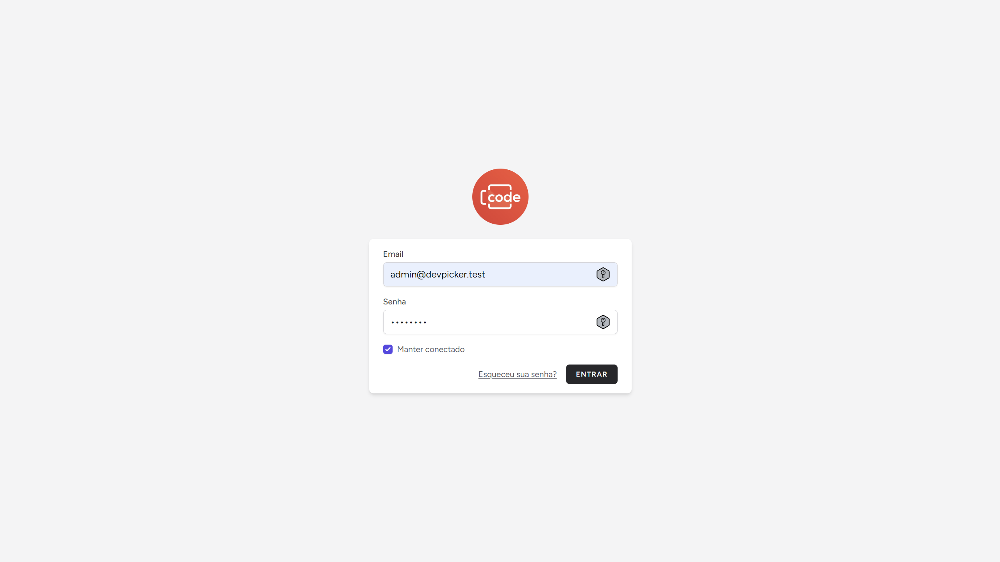
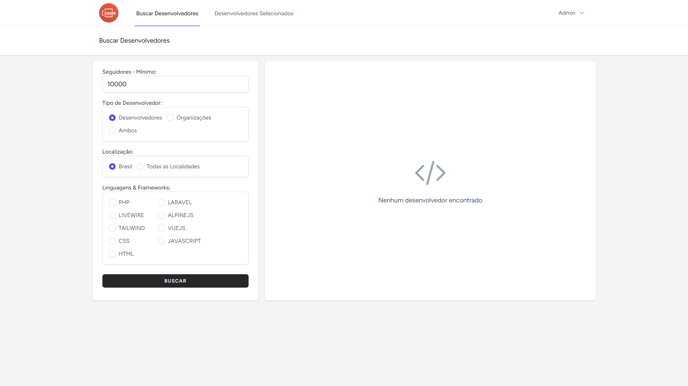
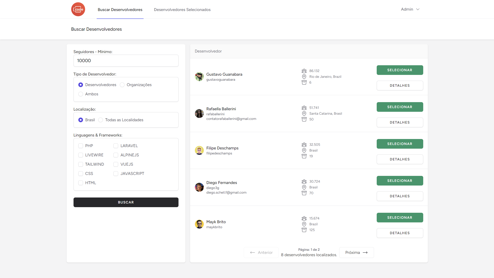
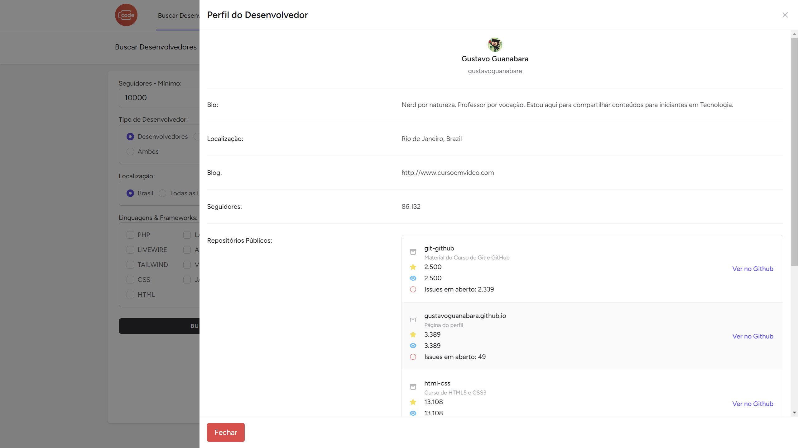
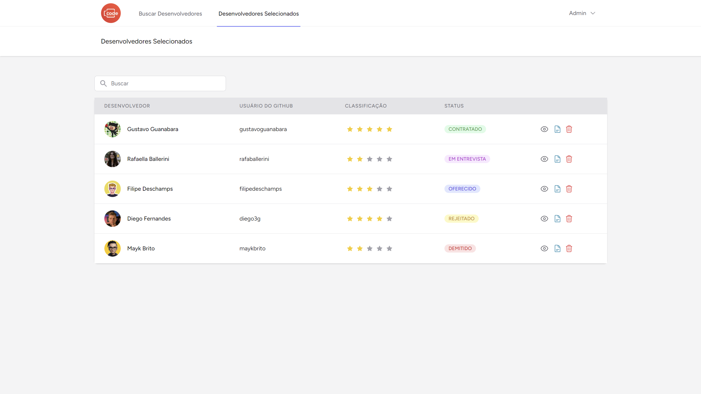
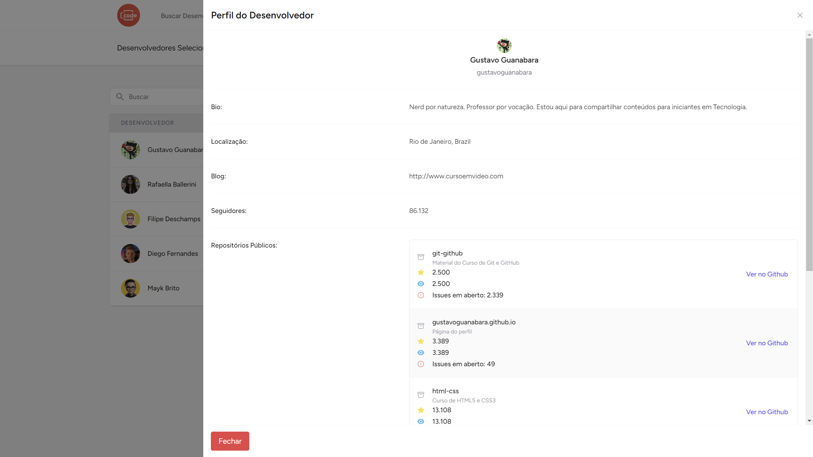
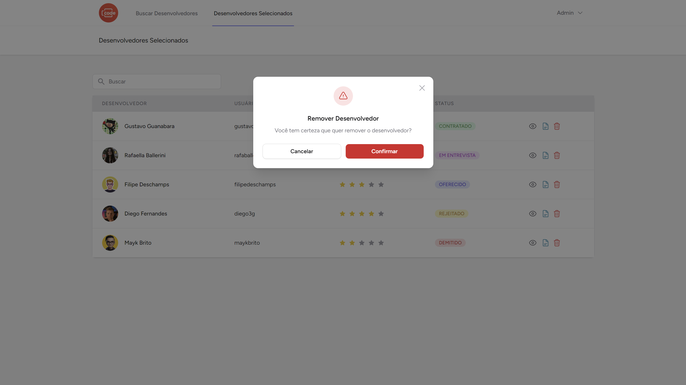
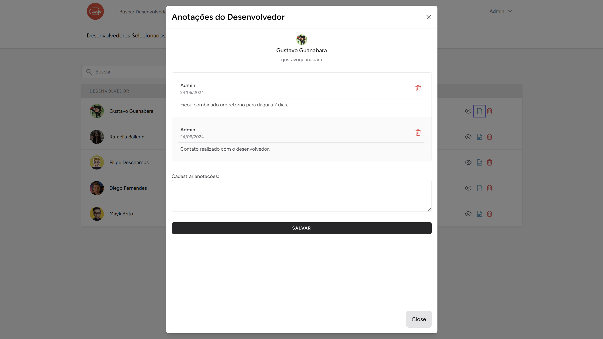
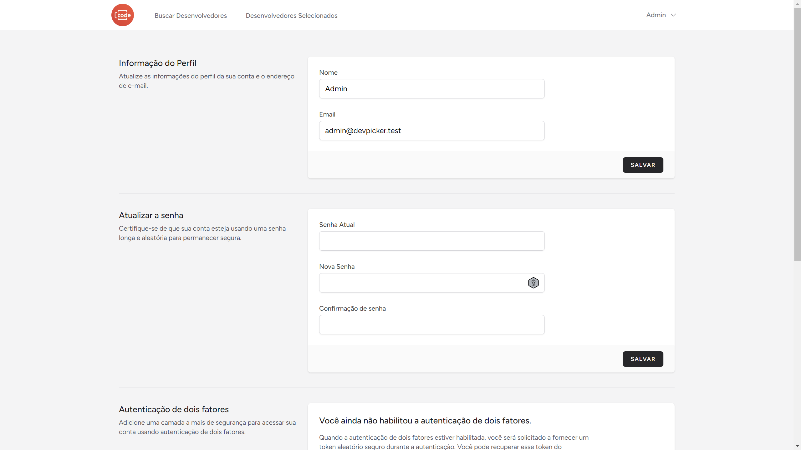
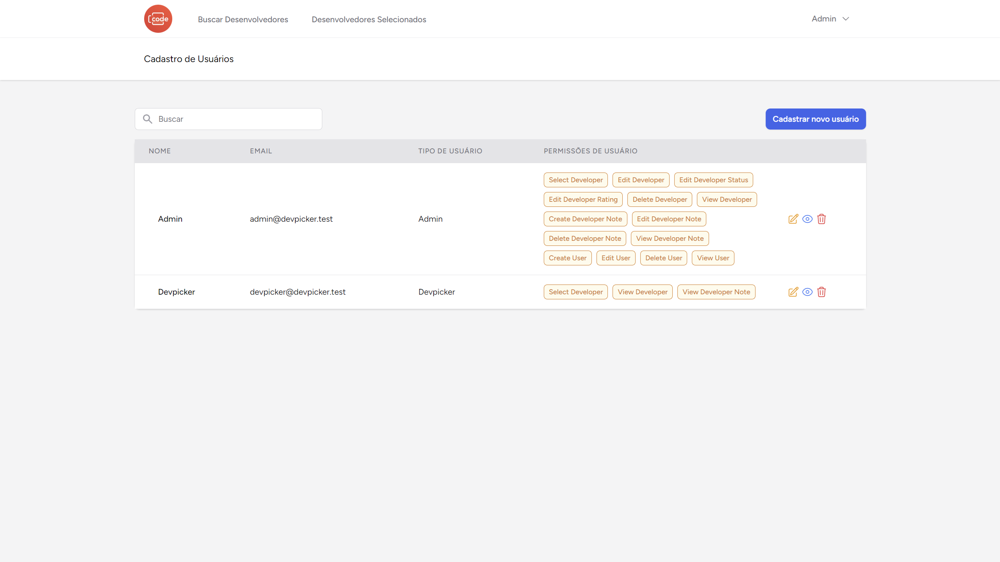
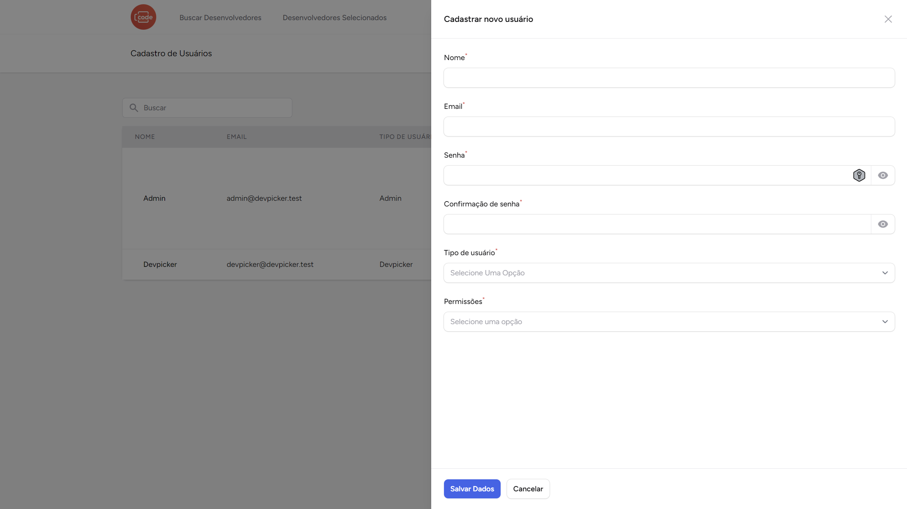
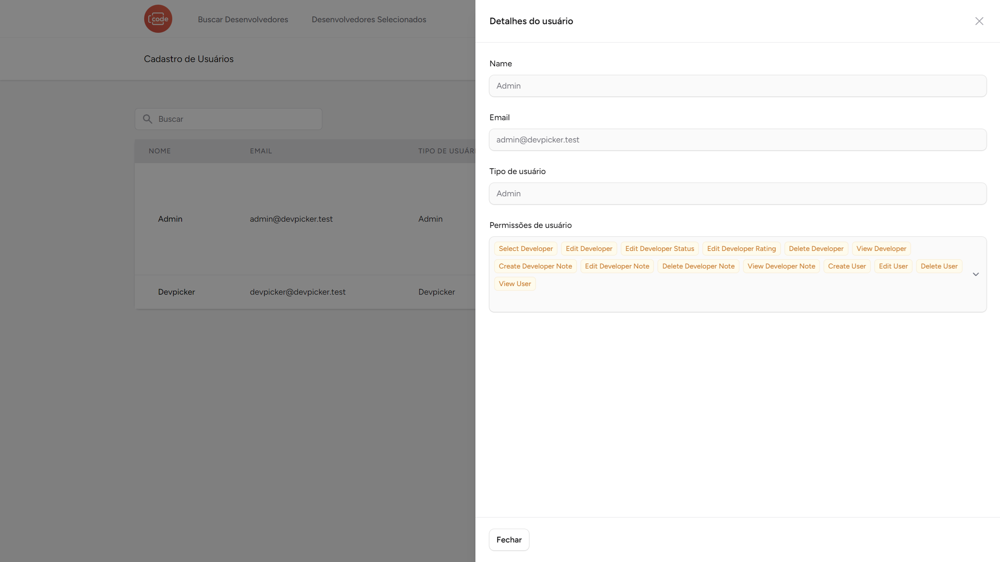
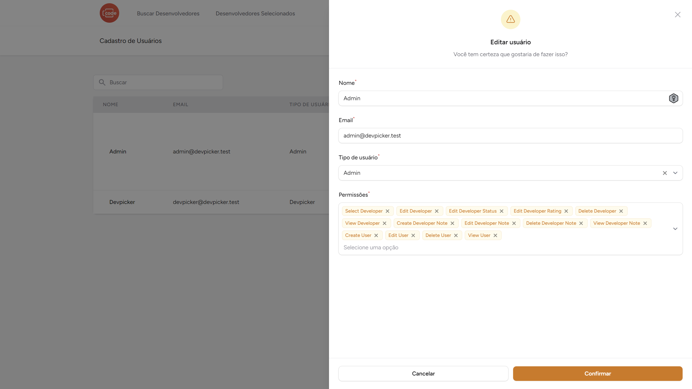

This repo is currently a work in progress — PRs and issues welcome!

# Getting started

## Installation

Please check the official laravel installation guide for server requirements before you start. [Official Documentation](https://laravel.com/docs/11.x)

Clone the repository

    git clone https://github.com/otavio-araujo/dev-picker.git

Switch to the repo folder

    cd dev-picker

Install all the dependencies using composer and npm

    composer install
    npm install

Copy the example env file and make the required configuration changes in the .env file

    cp .env.example .env

Generate a new application key

    php artisan key:generate

Run the database migrations and seeders (**Set the database connection in .env before migrating**)

    php artisan migrate

Build your assets & start the local development server

    npm run build
    npm run dev

**Command list**

    git clone https://github.com/otavio-araujo/dev-picker.git
    cd dev-picker
    composer install
    npm install
    cp .env.example .env
    php artisan key:generate
    php artisan migrate
    npm run build
    npm run dev

## Database seeding

**You need to populate the database to create initial users, roles and permissions**

Open the terminal run the following command:

    php artisan db:seed

Default Admin Role login information:

    email: admin@devpicker.test
    password: password

Default Devpicker Role login information:

    email: devpicker@devpicker.test
    password: password

**_Note_** : It's recommended to have a clean database before seeding. You can refresh your migrations at any point to clean the database by running the following command

---

    php artisan migrate:refresh

### Overview

This application offers support for real-time search for github developers. The application uses the Github Restfull API to fech developers within the selected filters and attributes.

**Disclaimer**: There is no affiliation between this application and Github Restfull API.

Once you have your API key, you can enable the feature by setting the `CURRENCY_API_KEY` environment variable in your `.env` file.

### Initial Setup

After setting your API key in the `.env` file, it is essential to set your `GITHUB_API_TOKEN` to ensure that the API accepts the correct comunication with the aplication.

So, open your `.env` file and create a new `GITHUB_API_TOKEN` key and paste your Token:

`GITHUB_API_TOKEN=github_pat_11AHIXSGY0PxxGnGX1c....`

This ensures the correct comunication whit Github Restfull API.

## Mailgun

A aplicação está pré-configurada para utilizar o Mailgun como driver de envio de emails. O envio de emails é utilizado para recuperação de senha.

Para configurar o mailgin, adicione ao .env as seguintes informações de sua conta Mailgun:

`MAIL_MAILER=mailgun`
`MAILGUN_DOMAIN=your-mailgun-domain`
`MAILGUN_SECRET=your-api-key`
`MAILGUN_ENDPOINT=api.mailgun.net`
`MAIL_FROM_ADDRESS=no-reply@devpicker.com`
`MAIL_FROM_NAME="${APP_NAME}"`

##Screenshots Explained

#Login page

This featurs is just a simple login page. The credentials are:

Default Admin Role login information:

    email: admin@devpicker.test
    password: password

Default Devpicker (CTO) Role login information:

    email: devpicker@devpicker.test
    password: password

## Dependencies

-   [filamentphp/actions](https://github.com/filamentphp/filament) - Open interactive modals and slide-overs - a great way to keep the user in the flow of the application.
-   [filamentphp/notifications](https://github.com/filamentphp/filament) - Notify your users of important events by delivering real-time messages using Livewire.
-   [knplabs/github-api](https://github.com/KnpLabs/php-github-api) - A simple Object Oriented wrapper for GitHub API, written with PHP.
    Uses GitHub API v3 & supports GitHub API v4. The object API (v3) is very similar to the RESTful API.
-   [laravel/jetstream](https://github.com/laravel/jetstream) - Laravel Jetstream is a beautifully designed application scaffolding for Laravel. Jetstream provides the perfect starting point for your next Laravel application and includes login, registration, email verification, two-factor authentication, session management, API support via Laravel Sanctum, and optional team management.
-   [spatie/laravel-permission](https://github.com/spatie/laravel-permission) - This package allows you to manage user permissions and roles in a database.

**_Note_** : It is recommended to read the documentation for all dependencies to get yourself familiar with how the application works.

## License

This project is licensed under the MIT License - see the [LICENSE](LICENSE) file for details.
